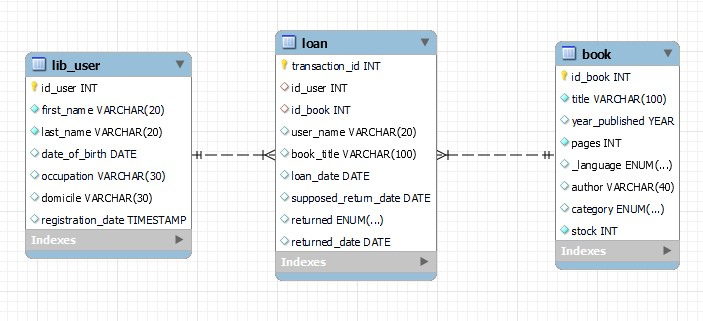

__SAT Library management system__ is an application for helping librarian do the job. This is simple app, designed using `python` as basic programming language and `mysql` as it’s database. `Tkinter`, `Pillow`, and `MySQLConnector` are the third party library use to create this app.

This app function such as :
 - library member and book data storage
 - do transaction such as loan or return the book
 - search book and user by it’s name
 - show list of stored user data and book data 

## Project Purpose
This project intended to develop an application to help librarian do his/her regular task. This app function as gui for input and show library data, and database for data storage. 

## Step By Step Project
### 1. Define requirement menu for this application 
> After defining the requirement, it is found that this appllication need following capability
> - input data for library new member
> - input data for new book collection
> - input data for book transaction (loan or returned)
> - show data of library users, book, loaned book, and returned book
> - search user data and book data inside the library database

### 2. Create the Database Structure 
> Database designed by using three table with following entiry relationsip diagram 

> 

> `lib_user` table use to store the library member data, this table comprises of field :

| id_user | first_name | last_name | date_of_birth | occupation | domicile | registration_date |
|:---|:---:|:---:|:---:|:---:|:---:|---:|

> `id_user` and `registration_date` designed to be autofilled by mysql

> `book` table use to store the library book data, this table comprises of field:

| id_book | title | year_published | pages | _language | author | category | stock |
|:---|:---:|:---:|:---:|:---:|:---:|:---:|---:|

> `id_book` designed to be autodilled by mysql

> `loan` table use to store book transaction (loan and return) data for the libary. This table comprises of 

| transaction_id | id_user | id_book | user_name | book_title | loan_date | supposed_return_date | returned | return_date |
|:---|:---:|:---:|:---:|:---:|:---:|:---:|:---:|--:|

> - `id_user`,`id_book`, `user_name`, and `book_title`, will be autofilled from other table.
> - `loan_date` will be auto-filled with transaction date.
> - `supposed_return_date` will be filled by function
> - `loan_duration` which count loan days based on book pages. The more pages the book, the more days user can borrow it.
> - `retured` will be auto-filled with `YES` or `NO` describing if the book has been returned or not.
> - `return_date` will be auto-filled with returned transaction date. 

### 3. Create Function and Procedure for the Database 
> Because the activity of this application is limited, it is a good idea to make `procedures` and `function`, this also will make the connector and python more simple to code. Following is the list of function and procedure in this project

| Procedure | Function |
|:---:|:---:|
|input_user|loan_duration|
|input_book|
|show_users|
|show_books|
|show_loans|
|show_returns|
|search_user_by_name|
|search_book_by_title|
|loan_book|
|return_book|
|exit_user|

This table and function was encapsulated inside mysql script file `library-management-db.sql` 

### 4. Create Connector for Database to Python
Connector was designed to connect mysql database to python GUI. `connect_mysql.py` files contain necesarry function to connect database to GUI. It is made separated from GUI python code to maintain code modularity. This file later imported to `lib-management-gui-app.py` to fully functioning this app

### 5. Create GUI for every menu defined

GUI was designed by using library `tkinter` and `pillow`. `Tkinter` basic building comprises of `frame or canvas` and `children or widget` which arraged using `layout manager` method. `Object Oriented Program` style was mainly used to develop this app. Every menu group in this app designed to be encapsulated into one class, then every menu will be act as instance of this class. Inside every class, `frame` and `widget` are arranged to construct GUI menu, function from connector are embeded to specific `widget` to connect GUI to database. Here is the list of class and instance in `lib-management-gui-app.py`

| Class | Instance |
|:---:|:---:|
|LoginPage|app|
|StartPage|
|Show|
|Search|
|BookTransaction|
|DeleteUser|
|search_user_by_name|
|search_book_by_title|
|loan_book|
|return_book|
|exit_user|

### 7. Test every menu inside the App, enhance the code defense
### 8. Correct/Update the code if there is a mistake
### 9. Create the executable file

## Application Menu
### 1. Login Page
### 2. New User Registration
### 3. New Book Registration
### 4. Show List of User
### 5. Show List of Book
### 6. Show List of Loan
### 7. Show List of Return
### 8. Search User by Name
### 9. Seach Book by Name
### 10. Loan Book
### 11. Return Book
### 12. Clear User

## How to Use This Program
1. Make sure you have python and mysql inside your local system
2. Install Third party module prequisit for the application : Tkinter, Pillow, MySQL Connector
3. Clone this repository
4. Execute the sql script to create the database
5. For gui you can execute the py files or exe files

## Suggestion
It will be interesting if development continued by using UI/UX app such as [`figma`](https://www.figma.com/) or [`sketch`](https://www.sketch.com/). And we can upgrade the simplicity of the code so executable file doesn't have to be as large as now almost 90 MB just for entry and show data.

If u have any other comment you can email-me on yudi.stefanus22@gmail.com or contact me through [my Linkedin](https://www.linkedin.com/in/stefanusyudi22/). Enjoyy....

<table>
    <thead>
        <tr>
            <th>Layer 1</th>
            <th>Layer 2</th>
            <th>Layer 3</th>
        </tr>
    </thead>
    <tbody>
        <tr>
            <td rowspan=4>L1 Name</td>
            <td rowspan=2>L2 Name A</td>
            <td>L3 Name A</td>
        </tr>
        <tr>
            <td>L3 Name B</td>
        </tr>
        <tr>
            <td rowspan=2>L2 Name B</td>
            <td>L3 Name C</td>
        </tr>
        <tr>
            <td>L3 Name D</td>
        </tr>
    </tbody>
</table>

