

__SAT Library management system__ is an application for helping librarian do the job. This is simple app, designed using `python` as basic programming language and `mysql` as it’s database. `Tkinter`, `Pillow`, and `MySQLConnector` are the third party library use to create this app.

This app function such as :
 - library member and book data storage
 - do transaction such as loan or return the book
 - search book and user by it’s name
 - show list of stored user data and book data 

## Project Purpose
This project intended to develop an application to help librarian do his/her regular task. This app function as gui for input and show library data, and database for data storage. 

## Step By Step Project
### 1. Define requirement menu for this application 
> After defining the requirement, it is found that this appllication need following capability
> - input data for library new member
> - input data for new book collection
> - input data for book transaction (loan or returned)
> - show data of library users, book, loaned book, and returned book
> - search user data and book data inside the library database

### 2. Create the Database Structure 
> Database designed by using three table with following entiry relationsip diagram 

> 

> `lib_user` table use to store the library member data, this table comprises of field :

| id_user | first_name | last_name | date_of_birth | occupation | domicile | registration_date |
|:---|:---:|:---:|:---:|:---:|:---:|---:|

> `id_user` and `registration_date` designed to be autofilled by mysql

> `book` table use to store the library book data, this table comprises of field:

| id_book | title | year_published | pages | _language | author | category | stock |
|:---|:---:|:---:|:---:|:---:|:---:|:---:|---:|

> `id_book` designed to be autodilled by mysql

> `loan` table use to store book transaction (loan and return) data for the libary. This table comprises of 

| transaction_id | id_user | id_book | user_name | book_title | loan_date | supposed_return_date | returned | return_date |
|:---|:---:|:---:|:---:|:---:|:---:|:---:|:---:|--:|

> - `id_user`,`id_book`, `user_name`, and `book_title`, will be autofilled from other table.
> - `loan_date` will be auto-filled with transaction date.
> - `supposed_return_date` will be filled by function
> - `loan_duration` which count loan days based on book pages. The more pages the book, the more days user can borrow it.
> - `retured` will be auto-filled with `YES` or `NO` describing if the book has been returned or not.
> - `return_date` will be auto-filled with returned transaction date. 

### 3. Create Function and Procedure for the Database 
> Because the activity of this application is limited, it is a good idea to make `procedures` and `function`, this also will make the connector and python more simple to code. Following is the list of function and procedure in this project

|Procedure|input_user, show_users, show_books, show_loans, show_returns, search_user_by_name, search_book_by_title, loan_book, return_book, exit_user|
|:---:|:---|
|Function|loan_duration|

This table and function was encapsulated inside mysql script file `library-management-db.sql` 

### 4. Create Connector for Database to Python
Connector was designed to connect mysql database to python GUI. `connect_mysql.py` files contain necesarry function to connect database to GUI. It is made separated from GUI python code to maintain code modularity. This file later imported to `lib-management-gui-app.py` to fully functioning this app

### 5. Create GUI for every menu defined

GUI was designed by using library `tkinter` and `pillow`. `Tkinter` basic building comprises of `frame or canvas` and `children or widget` which arraged using `layout manager` method. `Object Oriented Program` style was mainly used to develop this app. Every menu group in this app designed to be encapsulated into one class, then every menu will be act as instance of this class. Inside every class, `frame` and `widget` are arranged to construct GUI menu, function from connector are embeded to specific `widget` to connect GUI to database. Here is the list of class and instance in `lib-management-gui-app.py`

<table>
    <thead>
        <tr>
            <th>Class</th>
            <th>Instance</th>
        </tr>
    </thead>
    <tbody>
        <tr>
            <td>LoginPage</td>
            <td>app</td>
        </tr>
        <tr>
            <td>StartPage</td>
            <td>start_page</td>
        </tr>
        <tr>
            <td>UserRegistration</td>
            <td>user_registration</td>
        </tr>
        <tr>
            <td>BookRegistration</td>
            <td>book_registration</td>
        </tr>
        <tr>
            <td rowspan=4>Show</td>
            <td>show_users</td>
        </tr>
        <tr>
            <td>show_books</td>
        </tr>
                <tr>
            <td>show_loans</td>
        </tr>
                <tr>
            <td>show_returns</td>
        </tr>
        <tr>
            <td rowspan=2>Search</td>
            <td>search_user</td>
        </tr>
        <tr>
            <td>search_book</td>
        </tr>
        <tr>
            <td rowspan=2>BookTransaction</td>
            <td>loan_book</td>
        </tr>
        <tr>
            <td>return_book</td>
        </tr>
        <tr>
            <td rowspan=2>DeleteUser</td>
            <td>delete_user</td>
        </tr>
    </tbody>
</table>

### 6. Test, Correct, update, and enhance the code defense if there is a mistake
After GUI finish and can be executed by python, then development continued to test te application. Several error was foound at the development, but that was good to enhance the application defence to false input from the user, and make sure the application function as intended

### 7. Create the executable file

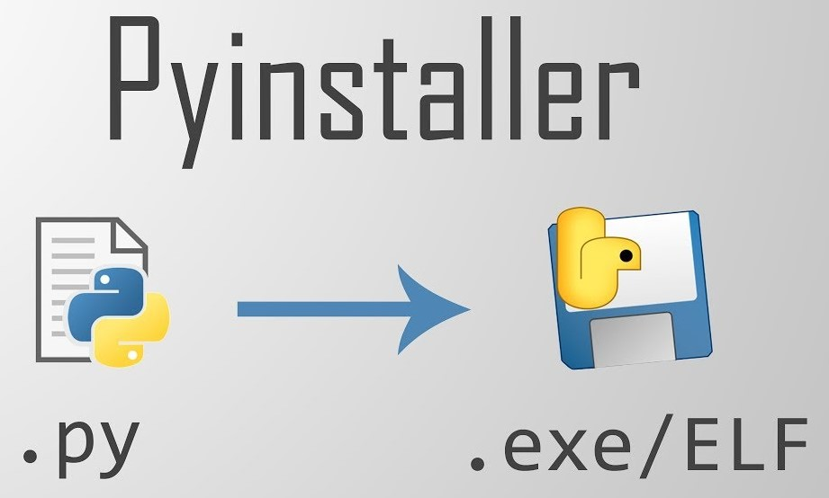

`PyInstaller` was use to create the executable file for the application. This third party library convert .py file into .exe file. It is suitable for this app development. The output then become fully operational application `lib-management-app.exe`.  

## Application Menu
### 1. Login Page
> 
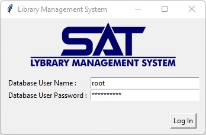

> Login page require your database credential (username, and password), it connect directly to mysql-server installed in local computer. 

### 2. Main Page
> 
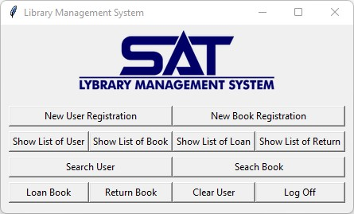

> Main page contains all menu inside the application. This menu is the result of defined requirement for librarian job at the first time

### 3. New User Registration
>
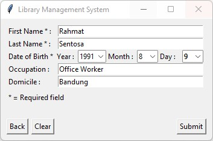

> User Registration menu is use to input new libary member data. This page has defense if you not fill it completely, member data won't be entering database

### 3. New Book Registration

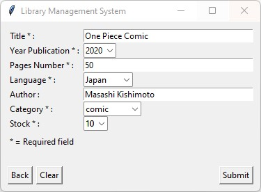

> Book Registration menu is use to input new book data. This page has defense if you not fill it completely, book data won't be entering database

### 4. Show List of User
>
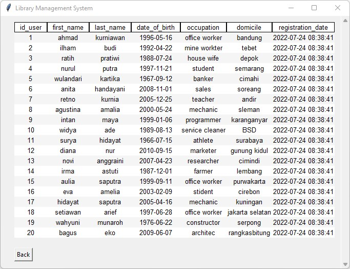

> This menu show list of user data registered to the library  

### 5. Show List of Book
>
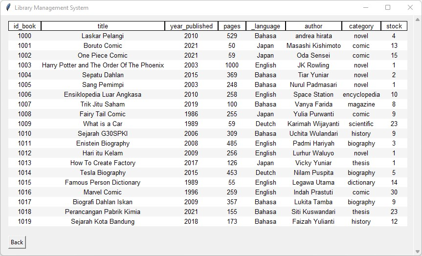

> This menu show list of book data registered to the library

### 6. Show List of Loan
>

> This menu show list of loaned book and it's status, whether it is has been returned or not

### 7. Show List of Return
>
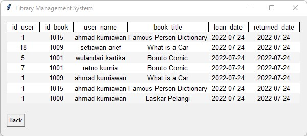

>This menu show list of returned book to library

### 8. Search User by Name
>
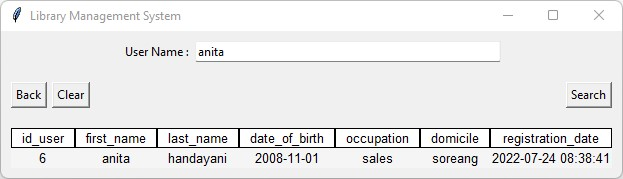

>Search user by name menu function as seach menu for user. Using regex we could search user by its name in the list of user registered

### 9. Seach Book by Name
>
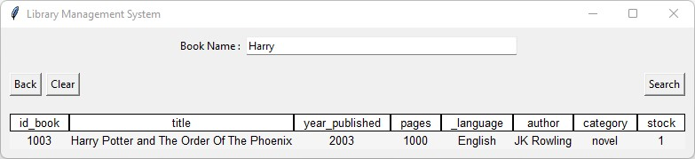

>Search book by name menu function as seach menu for book. Using regex we could search book by its name in the list of book registered to the library

### 10. Loan Book
>

>Loan book menu is use if any member want to loan book from the library. It has specific defense that if the stock of the book at the libary empty, no one can find that on the list to be borrowed. 

### 11. Return Book
>
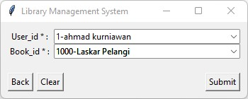

> Return book menu is use if any member want to return the book to the library. The book list will show only the book that borrowed by the library member

### 12. Clear User
>
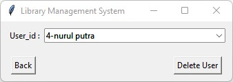

> Clear user menu is use if anyone want to erase their data frong the library, but the member have to be returned all the book first, unless the member data cannot be erased from the database

## How to Use This Program
1. Make sure you have python and mysql inside your local system
2. Install Third party module prequisit for the application : Tkinter, Pillow, MySQL Connector
3. Clone this repository
4. Execute the sql script to create the database
5. For gui you can execute the py files or exe files

## Suggestion
It will be interesting if development continued by using UI/UX app such as [`figma`](https://www.figma.com/) or [`sketch`](https://www.sketch.com/). And we can upgrade the simplicity of the code so executable file doesn't have to be as large as now almost 90 MB just for entry and show data.

If you have any other comment you can email-me on yudi.stefanus22@gmail.com or contact me through [my Linkedin](https://www.linkedin.com/in/stefanusyudi22/). Enjoyy....

